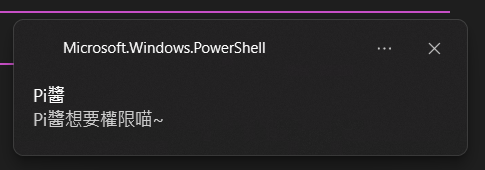

# pi-windows-notifier

[Pi 套件頁](https://pi.dev/packages/pi-windows-notifier) · [GitHub](https://github.com/C-W-Z/pi-windows-notifier) · [npm](https://www.npmjs.com/package/pi-windows-notifier)

[English](README.md) | [繁體中文](README.zh-TW.md)

**專為 Windows 設計。0 依賴套件。可自定義，以安全為優先的提示音與通知插件。**

需要你確認權限、回答問題，或模型回應結束時，會自動跳出 Windows 通知，並播放系統提示音或你自訂的 WAV 音效。就算你正在看別的視窗也會提醒，讓你不用一直盯著 Pi。

通知不會從 session 帶出問題、命令、檔案路徑或模型回答，但你可以設定自己的固定提醒文字。它也不會替你批准權限或回答問題，所有提醒都在本機處理。

使用 Pi 提供的 API、Node.js built-ins 與 Windows 內建通知和音效 API，不必另裝通知函式庫或外部播放器。設計上避開了許多其他同類套件的高風險做法；具體防護與限制見[隱私與程序安全](#隱私與程序安全)。

## 預覽



## 安裝

```bash
pi install npm:pi-windows-notifier
```

安裝後開一個新的 Pi session 就能使用，不用先寫設定檔。五種通知和提示音預設都會開啟。

需要的環境：

- Windows 10 或 11。
- 64 位元 Node.js 22.19 以上，支援 x64 和 arm64。
- Pi 1.1.0 以上。
- Windows 內建的 Windows PowerShell 5.1。

只在 Pi 的互動式終端介面啟用。RPC、print、JSON 模式、其他作業系統和 32 位元 Node.js 都不會發通知。缺少必要 UI 事件的舊版 Pi 不支援。

移除套件：

```bash
pi remove npm:pi-windows-notifier
```

## 什麼時候會提醒？

| 事件 | 通知內容 | Windows 提示音 |
|---|---|---|
| `permission` | Permission approval needed | Exclamation |
| `question` | Waiting for your answer | Exclamation |
| `completed` | Response complete | Hand |
| `aborted` | Response interrupted | Exclamation |
| `failed` | Response failed | Exclamation |

彈窗標題預設是 **Pi**，預設訊息是英文。每個事件都能設定自己的標題與訊息；指令提示仍是繁體中文，沒有整體語言切換設定。

**權限提醒**搭配 `@gotgenes/pi-permission-system` 使用，也支援從 subagent 轉送到父 session 的權限請求。自動允許、自動拒絕，或已經有 session approval 的請求不會提醒。

**問題提醒**支援 `ask_user_question`（包含 RPIV Lean）和 `plan_mode_question`。一份問卷只提醒一次，不會每一題都響。模型在一般文字回答裡寫的問句，以及你手動打開的設定介面，不算這裡的提問。

**回應結束提醒**會等 Pi 真正結束這次回應才發送，不會在自動重試或續跑途中提早報完成。單一工具出錯，也不等於整次模型回應失敗。

權限和提問套件都是可選的；沒有安裝它們，仍然可以收到回應結束提醒。

### 提問辨識的限制

Pi 的 UI 事件沒有說明是哪個工具開了視窗。因此，只有恰好一個支援的提問工具正在執行，而且沒有權限提示或已知的其他 UI 佔用時，才會把等待畫面的訊號當成提問。資訊不明確就略過，並記錄 `UI_AMBIGUOUS`，不硬猜來源。

這個做法無法精確辨識所有重疊視窗的情況。RPIV 的 `rpiv:ask-user:blocked` 會提供額外訊號，並和共通 UI 事件一起去重。

有些提問套件本身也會發出 terminal bell。如果聽到額外的聲音，請檢查該套件或終端的提示音設定。

## 設定

想改預設行為時，請自行建立 `~/.pi/agent/extensions/pi-windows-notifier/config.json`。在 Windows 上，就是使用者家目錄裡的 `.pi\agent\extensions\pi-windows-notifier\config.json`。套件不會替你建立或修改這個檔案，也不讀專案內的設定。

新路徑優先；只有新檔案不存在時，才讀舊的 `~/.pi/agent/pi-windows-notifier/config.json`，兩份設定不會合併。新檔案若無效或無法讀取，會停用通知，不會改讀舊檔。想搬移設定時，請自行將原本的設定檔放到新路徑後 reload；套件不會搬動或改寫任何一份檔案。

### 完整設定範例

下面列出系統音效的欄位和五種事件，可以直接複製作為起點；檔案音效範例另列於下方。不過，**實際只要保留想修改的欄位，加上 `schemaVersion: 2` 就好**。每個事件都覆寫了共用訊息，因此這份範例的效果等同內建預設。

```json
{
  "schemaVersion": 2,
  "enabled": true,
  "defaults": {
    "toast": {
      "enabled": true,
      "title": "Pi",
      "message": "Pi needs your attention."
    },
    "sound": {
      "enabled": true,
      "source": {
        "type": "system",
        "name": "Exclamation"
      }
    }
  },
  "events": {
    "permission": {
      "enabled": true,
      "toast": { "enabled": true, "title": "Pi", "message": "Permission approval needed" },
      "sound": { "enabled": true, "source": { "type": "system", "name": "Exclamation" } }
    },
    "question": {
      "enabled": true,
      "toast": { "enabled": true, "title": "Pi", "message": "Waiting for your answer" },
      "sound": { "enabled": true, "source": { "type": "system", "name": "Exclamation" } }
    },
    "completed": {
      "enabled": true,
      "toast": { "enabled": true, "title": "Pi", "message": "Response complete" },
      "sound": { "enabled": true, "source": { "type": "system", "name": "Hand" } }
    },
    "aborted": {
      "enabled": true,
      "toast": { "enabled": true, "title": "Pi", "message": "Response interrupted" },
      "sound": { "enabled": true, "source": { "type": "system", "name": "Exclamation" } }
    },
    "failed": {
      "enabled": true,
      "toast": { "enabled": true, "title": "Pi", "message": "Response failed" },
      "sound": { "enabled": true, "source": { "type": "system", "name": "Exclamation" } }
    }
  }
}
```

### 欄位與覆寫規則

設定依序套用：**內建事件預設 → 共用的 `defaults` → 個別 `events.<事件>` 設定**。沒寫的欄位沿用前一層。例如，`defaults.toast.message` 會讓所有事件共用同一則訊息，除非事件另外設定自己的訊息；省略它就能保留內建的各事件文字。

| 欄位 | 用途 |
|---|---|
| `schemaVersion` | 使用這個格式時設為 `2` |
| `enabled` | 總開關，`false` 關閉所有通知 |
| `defaults` | 共用的 `toast` 和 `sound` 設定，沒有 `defaults.enabled` |
| `events.<事件>` | 可設定 `permission`、`question`、`completed`、`aborted`、`failed` |
| `events.<事件>.enabled` | 開啟或關閉整個事件 |
| `toast.enabled` | 彈窗開關 |
| `toast.title` | 固定的通知標題 |
| `toast.message` | 固定的通知訊息 |
| `sound.enabled` | 音效開關 |
| `sound.source.type` | `"system"` 使用 Windows 系統音效，`"file"` 使用本機 WAV |
| `sound.source.name` | `"system"` 必填：`Asterisk`、`Beep`、`Exclamation`、`Hand`、`Question`，大小寫要一致 |
| `sound.source.path` | `"file"` 必填：本機 WAV 的絕對路徑，最多 1024 個 UTF-16 code units |

`toast` 和 `sound` 欄位都能放在 `defaults` 或個別事件底下。**完整範例已寫出每個事件的所有欄位，只改 `defaults` 不會改到已被事件覆寫的值。** 想讓事件沿用共用設定，請刪除該事件底下對應的欄位。設定 `sound.source` 時必須提供 `type`，以及系統音效的 `name` 或檔案音效的 `path`，不能同時提供兩者；它會整組取代原本的來源。

- **只要彈窗**：將 `sound.enabled` 設為 `false`、`toast.enabled` 設為 `true`。
- **只要音效**：將 `toast.enabled` 設為 `false`、`sound.enabled` 設為 `true`。
- 兩個通道都關閉時，不啟動 helper。事件可以覆寫共用通道開關，但不能繞過已關閉的總開關或事件開關。

沒有設定檔時，所有事件與通道都開啟，標題是 Pi，訊息是英文。完成通知使用 Hand，其他事件使用 Exclamation。

### 文字與音效限制

文字會照你寫的內容顯示，不會從 session 帶入變數，也沒有模板替換。標題最多 128 個 UTF-16 code units，訊息最多 512 個；emoji 可能算兩個。兩者都必須是非空白的單行字串，不能包含控制字元或不合法的 XML 字元。自訂文字會出現在 Windows 通知裡，請不要放敏感資訊；它不會顯示在 `status` 或錯誤提示中。

音效名稱選的是 **Windows 系統音效事件**，不是套件內附的不同音效檔。實際聲音取決於 Windows 音效配置；不同事件可能共用同一個聲音，也可能沒有對應音效。你可以在 Windows「音效」設定中查看或修改對應，但修改也會影響使用相同事件的其他程式。改用檔案來源只影響這個 extension，不會修改 Windows 音效配置。

### 自訂 WAV 音效

例如，讓回應完成時播放你自己的音效：

```json
{
  "schemaVersion": 2,
  "events": {
    "completed": {
      "sound": {
        "source": { "type": "file", "path": "C:/Users/you/Sounds/done.wav" }
      }
    }
  }
}
```

同樣的 `sound.source` 也可以放在 `defaults`，讓多個事件共用檔案，或為每個事件選擇不同音效。想沿用 `defaults` 時，請移除原本事件底下的來源覆寫。

> 格式、路徑、大小與長度限制是刻意的安全取捨：讓檔案存取與播放保持有界，不引入外部 codec／播放器選擇或網路音訊來源。這個 extension 著重短提示音，不是通用媒體播放器。
- 使用本機**固定磁碟**上的絕對路徑，例如 `C:/Sounds/done.wav`。正斜線可以直接使用，避免 JSON 跳脫；使用反斜線時，`C:\Sounds\done.wav` 在 JSON 要寫成 `"C:\\Sounds\\done.wav"`。
- 不支援相對路徑、`~`、環境變數展開、URL、UNC 路徑、網路磁碟、裝置路徑、alternate data streams 或 reparse points（包含上層目錄的 junction／symlink）。
- 檔案必須是 RIFF PCM WAV：mono 或 stereo、8 或 16 bit、8–48 kHz，最多 **5 秒**、**5 MiB**。不支援 MP3、壓縮 WAV 或 WAV extensible；把 MP3 改名成 `.wav` 也不能播放。
- 不提供個別音量、循環播放、外部播放器或內附音效。請使用可信任且有權使用的音訊。
- reload 時驗證路徑；只有啟用的音效實際提交時，才讀取並檢查檔案。檔案不存在、無法讀取、格式不支援或超過限制時回報 `SOUND_FAILED`，彈窗仍會嘗試送出，不會改播系統音效。
- 檔案路徑透過 stdin 送入固定 helper，不放在命令參數，也不顯示在 `status` 或錯誤提示中。

### 套用修改與舊格式相容

修改後執行 `/reload` 或 `/windows-notifier reload`。如果有未知欄位、不支援的版本或音效來源、值不合法、檔案無法讀取或超過 16 KiB，通知會先停用；修正後再 reload 即可。錯誤提示不會印出設定檔內容。

原本沒有版本欄位、音效使用 boolean 的格式（例如 `events.completed.sound: false`）仍能使用，只在記憶體裡轉換，不會修改你的檔案。要使用新的通道物件，請加上 `schemaVersion: 2`；不要把舊的音效 boolean 和 v2 物件混在一起。

## 指令

在 Pi 裡執行。輸入 `/windows-notifier ` 後按 **Tab**，會列出 `status`、`reload` 或 `test`；用 **↑/↓** 選擇，再按 **Tab** 接受。補完 `test` 會自動加上空白，接著連按 **Tab** 即可列出並接受事件名稱，不必手動輸入空白；也支援 `test co` 這類前綴。

```text
/windows-notifier status
/windows-notifier reload
/windows-notifier test
/windows-notifier test permission
```

- `status`：查看通道開關、音效選擇、backend 狀態、佇列計數和診斷碼，不會顯示自訂文字、檔案路徑或 session 內容。
- `reload`：重新讀取設定，取消舊的通知工作。
- `test`：預設測試完成通知，也能指定 `permission`、`question`、`completed`、`aborted` 或 `failed`。

**測試會真的跳通知、播放音效。** 和自動通知一樣，它會遵守開關、佇列與限流，不會強行送出已停用的事件。


## 常見問題

### 為什麼沒看到通知？

Windows 仍然有最終決定權。勿擾模式、通知設定、系統音效方案和靜音，都可能讓已提交的通知沒有彈出或沒有聲音。

因為使用 `Microsoft.Windows.PowerShell` AppID，通知來源可能顯示 **PowerShell**，但彈窗標題預設是 **Pi**，也可以改成你設定的標題。Toast 自帶的音效關閉，提示音另外播放，避免這個 backend 自己重複響兩次。彈窗和音效分開處理，一個失敗仍會嘗試另一個；沒有備用通知方式或播放器。

可以用 `/windows-notifier status` 查看診斷碼：

| 診斷碼 | 意義或處理方式 |
|---|---|
| `CONFIG_INVALID`／`CONFIG_TOO_LARGE`／`CONFIG_READ_FAILED` | 修正全域設定檔後 reload |
| `ENV_UNSUPPORTED` | 請使用支援的 Windows 64 位元 Pi 互動式介面 |
| `BACKEND_UNAVAILABLE` | 檢查 Windows 路徑、PowerShell 和 helper 是否可用 |
| `UI_AMBIGUOUS`／`TOOLS_LIMIT` | 無法安全辨識 UI 來源，或追蹤已達上限 |
| `QUEUE_DROPPED` | 佇列已滿，有通知被丟棄 |
| `HELPER_TIMEOUT`／`OUTPUT_LIMIT`／`LAUNCH_FAILED` | helper 超時、輸出過多或啟動失敗 |
| `TOAST_FAILED`／`SOUND_FAILED`／`BOTH_FAILED` | Windows 彈窗、音效或兩者提交失敗 |
| `INPUT_INVALID`／`INTERNAL_ERROR`／`HELPER_PROTOCOL` | 檢查套件安裝與 helper 協定 |

自動通知錯誤最多每分鐘顯示一次終端警告。診斷只使用固定代碼，不會帶出 PowerShell 原始錯誤內容。

## 隱私與程序安全

套件透過固定的 PowerShell 腳本呼叫 Windows 內建通知和音效 API，不用另外裝通知服務或播放器。沒有網路通知、遙測、下載或內附音效檔。

部分功能限制是刻意的安全設計，不只是平台限制。以下防護針對命令注入、執行檔搜尋劫持、憑證意外外洩、網路路徑存取、無界程序建立，以及誤傷其他程式等風險；不代表套件保證沒有漏洞。

- 為降低執行檔搜尋劫持風險，PowerShell 使用啟動環境的 `SystemRoot`／`windir` 下的絕對路徑，不從專案目錄或 `PATH` 搜尋。
- 為避免設定值造成命令／XML 注入，helper 不透過 shell 執行，只從 stdin 接收事件類型、已驗證的通道設定（含自訂音效的本機 WAV 路徑）與固定設定文字。文字用 DOM text node 加進通知，不拼進 PowerShell 命令或 XML，也不傳入 session 內容。
- 為降低憑證意外外洩風險，子程序只拿到必要的 Windows 環境變數，不繼承 Pi 的完整環境或 API tokens。`-ExecutionPolicy Bypass` 只作用於該子程序，不會取得管理員權限或改動永久設定，也不把 Execution Policy 當成安全邊界。
- WAV 播放前會檢查本機磁碟路徑與 reparse points，讀入有大小限制的記憶體並驗證格式，再交給 `System.Media.SoundPlayer`。播放留在同一個 helper，沿用逾時與取消機制；檔案檢查不是防止攻擊者同時修改路徑的 sandbox。
- 為限制大量程序啟動與資源消耗，同時最多一個 helper，佇列最多 16 筆，啟動至少間隔一秒。工作等待超過 30 秒會過期，helper 的 timeout 是 10 秒，stdout 和 stderr 各限制 8 KiB。權限和提問比回應結束通知優先。
- 為避免誤關其他程式，只嘗試終止自己建立的子程序，不會按名稱關閉其他程序。如果 Windows 不允許終止，就等它結束，不會繼續堆出新的 helper。
- 權限決策、問題結束、新回應、reload、session 切換和 shutdown 都會取消相關舊工作。已經顯示的 Toast 無法收回，取消和提交給 Windows 之間仍可能發生競態。

這些防護假設 Windows 系統目錄、Pi 啟動環境和已安裝套件可信。它們無法防禦同程序裡的惡意 extension，或已遭入侵的使用者帳號。Pi permission system 並不是 extension 的 OS 沙盒。

## 開發

```bash
npm ci --ignore-scripts
npm run verify
npm pack --dry-run
```

測試使用假時鐘、event bus 和 launcher。Windows 上也會檢查 PowerShell 語法、無效輸入、PCM WAV 驗證、有界檔案讀取與 junction 拒絕。一般 `npm test` 不會跳彈窗或播放音效；測試範圍與仍需確認的項目見[驗證紀錄](docs/verification.md)。

## 授權

MIT。上游來源和授權聲明見 [THIRD_PARTY_NOTICES.md](THIRD_PARTY_NOTICES.md)。
